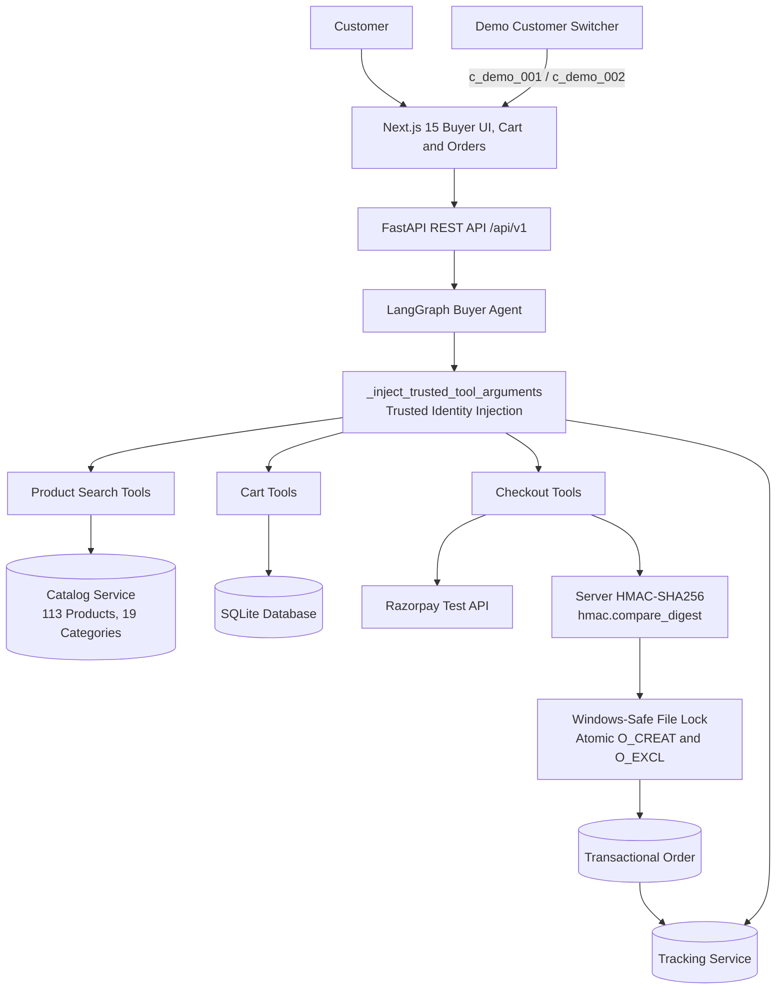

# AgentPay — AI-Powered Agentic Commerce Platform

[](https://fastapi.tiangolo.com)
[](https://nextjs.org)
[](https://github.com/langchain-ai/langgraph)
[](https://razorpay.com)
[](https://python.org)
[](https://www.typescriptlang.org)
[](https://pytest.org)
[](LICENSE)

**Submission for Razorpay AI Buildathon 2026 — Track 1: AI Growth & Agentic Commerce**

AgentPay is an autonomous commerce platform that connects natural-language product discovery across 113+ catalog products, multi-turn conversational refinement, persistent customer carts, Razorpay Test Mode checkout, server-side cryptographic verification, and strict customer authorization isolation where the language model is never trusted with resource ownership.

---

## Capability & Implementation Status

| Capability | Status | Notes |
| :--- | :--- | :--- |
| **AI Product Discovery** | **Implemented** | Semantic search, price constraints, ratings, and comparisons across 113 SKUs |
| **Natural-Language Cart Management** | **Implemented** | Conversational add/update/remove with context pronoun resolution |
| **Markdown / GFM Response Rendering** | **Implemented** | Polished GitHub Flavored Markdown in Buyer chat with responsive tables, bolding, lists, and safe links |
| **Persistent Cart** | **Implemented** | Persistent cart state across page transitions (`Buyer ↔ Cart`) |
| **Persistent Conversation** | **Implemented** | Scoped multi-turn chat history preserved across sessions |
| **Checkout Orchestration** | **Implemented** | Cart validation, stock reservation, and transaction assembly |
| **Razorpay Test Mode** | **Implemented** | Official Razorpay Python SDK order creation & standard checkout modal |
| **HMAC Payment Verification** | **Implemented** | Server-side HMAC-SHA256 verification using constant-time `hmac.compare_digest` |
| **Customer Authorization Isolation** | **Implemented** | Cross-tenant access rejected with `HTTP 403 Forbidden` across all routes |
| **Inventory Concurrency Protection** | **Implemented** | Atomic cross-process file locking (`O_CREAT \| O_EXCL`) with Windows safety |
| **Order Tracking & Lifecycle** | **Implemented** | Real-time timeline, demo status advancement, cancellation, refunds, returns |
| **Related Products / Cross-sell** | **Implemented** | User-requested / reactive product recommendations and complementary item discovery |
| **Production Authentication** | *Not Implemented* | Demo personas (`c_demo_001`, `c_demo_002`) used for buildathon evaluation |

---

## Core Engineering Principles

Traditional conversational commerce demos connect language models directly to CRUD APIs. If the model is prompted maliciously (or hallucinates), it can emit tool arguments targeting another user's cart or order.

AgentPay addresses this by treating the LLM as an **untrusted reasoning engine**:

1. **Agentic Commerce:** Autonomous discovery, comparison, and cart actions powered by a cyclic LangGraph state machine.
2. **Persistent State:** Multi-turn conversation and cart state persist across page navigation and session reloads.
3. **Trusted Server-Side Identity Injection:** The server intercepts model tool calls and forcefully overwrites identity arguments (`customer_id`, `cart_id`, `merchant_id`) with verified session state.
4. **Strict Authorization Boundaries:** All API routes and domain services independently enforce customer ownership checks (`HTTP 403`).
5. **Cryptographic Payment Verification:** Razorpay signatures are recalculated and verified server-side using constant-time comparison before order placement.
6. **Concurrency-Safe Inventory:** File locking ensures serialized inventory decrements during concurrent checkouts.
7. **Rich Assistant Presentation:** Shopping responses are parsed as structured GitHub Flavored Markdown with clean responsive tables, styled headings, and readable typography.

---

## System Architecture



---

## The Security Boundary: LLM Output ≠ Trusted Identity

A central design guarantee in AgentPay is: **The model can request an action, but it does not get to decide who owns the resource.**

```text
LLM emits tool arguments:
{
  "customer_id": "c_demo_002",
  "cart_id": "cart_victim_123",
  "product_id": "ur_shoe_001"
}

             ↓
[ SECURITY BOUNDARY: _inject_trusted_tool_arguments ]
Server overwrites arguments with verified session state:
customer_id = "c_demo_001"
cart_id = "cart_demo_001"

             ↓
Trusted Tool Execution:
add_to_cart(customer_id="c_demo_001", cart_id="cart_demo_001", product_id="ur_shoe_001")

             ↓
[ SERVICE-LEVEL AUTHORIZATION CHECK ]
Resource.customer_id == "c_demo_001"  -->  PASS (or 403 Forbidden if mismatched)
```

In `backend/app/agents/graph.py`, `_inject_trusted_tool_arguments()` intercepts every tool call emitted by the model before invocation. Ownership-sensitive fields (`customer_id`, `cart_id`, `merchant_id`) are forcefully injected from the verified session context.

---

## How the Demo Works (Step-by-Step)

Follow this flow to evaluate the complete system:

1. **Open `/buyer`:** Land on the AI Buyer Assistant interface. The composer is persistently pinned to the bottom.
2. **Search Naturally:** Type `"Find running shoes under ₹5,000 with high ratings"`.
3. **Inspect Markdown & Cards:** The agent queries the 113-product catalog and renders a structured Markdown table along with interactive product recommendation cards.
4. **Contextual Refinement:** Type `"Compare the first two"` or `"Which one would you recommend?"`.
5. **Add to Cart:** Type `"Add the first one to my cart"` or click **Add to Cart** on the recommendation card.
6. **Cart Persistence Check:** Navigate to `/cart`; verify line items, subtotal, and auto-applied offers.
7. **Return to Buyer:** Click `← Continue Shopping` or the top navigation; verify the conversation history and cart remain fully intact.
8. **Initiate Checkout:** On `/cart`, click **Proceed to Checkout**.
9. **Select Razorpay:** Choose **Razorpay (Test Mode)** and click **Pay with Razorpay**.
10. **Test Payment:** Complete test payment in the standard Razorpay Checkout modal (or use the mock fallback).
11. **Signature Verification:** Server recalculates HMAC-SHA256 signature using `hmac.compare_digest`.
12. **Atomic Inventory Lock:** Inventory file lock is acquired, and product stock is decremented transactionally.
13. **Order Confirmation:** Order success screen displays Order ID, total, and fulfillment summary.
14. **Track Shipment:** Click **Track Shipment** (`/tracking/[orderId]`) to view the fulfillment timeline.
15. **Advance Order Status:** Click **Advance Status (Demo)** to simulate packing, shipping, and delivery.
16. **Switch Customer Persona:** Use the **Demo Customer** dropdown in the top bar to switch to **Customer B** (`c_demo_002`).
17. **Demonstrate Isolation (HTTP 403):** Customer B has an isolated cart; navigating to Customer A's order tracking page displays a prominent **ACCESS DENIED (HTTP 403 FORBIDDEN)** security screen.

---

## Security Testing & Adversarial Matrix

The test suite (`backend/tests/test_isolation.py` and `backend/tests/test_isolation_adversarial.py`) validates customer isolation across 15+ adversarial vectors:

| Attack Scenario | Endpoint / Function | Expected Response | Status |
| :--- | :--- | :---: | :---: |
| Customer A reads Customer B's cart | `GET /api/v1/cart/{b_id}?customer_id=a` | `403 Forbidden` | **PASS** |
| Customer A adds items to Customer B's cart | `POST /api/v1/cart/{b_id}/items?customer_id=a` | `403 Forbidden` | **PASS** |
| Customer A modifies item quantity in B's cart | `PATCH /api/v1/cart/{b_id}/items/{pid}?customer_id=a` | `403 Forbidden` | **PASS** |
| Customer A removes item from B's cart | `DELETE /api/v1/cart/{b_id}/items/{pid}?customer_id=a` | `403 Forbidden` | **PASS** |
| Customer A clears Customer B's cart | `DELETE /api/v1/cart/{b_id}?customer_id=a` | `403 Forbidden` | **PASS** |
| Customer A validates Customer B's cart | `POST /api/v1/cart/{b_id}/validate?customer_id=a` | `403 Forbidden` | **PASS** |
| Customer A checks out Customer B's cart | `POST /api/v1/cart/{b_id}/checkout` | `400 / 403 Forbidden` | **PASS** |
| Customer A reads Customer B's order | `GET /api/v1/checkout/order/{b_order_id}?customer_id=a` | `403 Forbidden` | **PASS** |
| Customer A tracks Customer B's order | `GET /api/v1/checkout/order/{b_order_id}/tracking?customer_id=a` | `403 Forbidden` | **PASS** |
| Customer A cancels Customer B's order | `POST /api/v1/checkout/order/{b_order_id}/cancel` | `403 Forbidden` | **PASS** |
| Customer A requests return on B's order | `POST /api/v1/checkout/order/{b_order_id}/return` | `403 Forbidden` | **PASS** |
| Direct tool call with forged customer ID | `get_cart(..., customer_id="a")` on B's cart | `PermissionError / ValueError` | **PASS** |
| Missing customer ID parameter | `GET /api/v1/checkout/order/{id}` (no query param) | `422 Unprocessable Entity` | **PASS** |
| Agent LLM emits forged `customer_id="b"` | LangGraph `_inject_trusted_tool_arguments` | Injected as `"a"` | **PASS** |

---

## Payment Security & Razorpay Integration

- **Official SDK Integration:** Integrates `razorpay.Client` to generate server-side orders with amounts in paise.
- **Cryptographic Signature Verification:**
  ```python
  def verify_payment_signature(razorpay_order_id, razorpay_payment_id, razorpay_signature, key_secret):
      msg = f"{razorpay_order_id}|{razorpay_payment_id}".encode("utf-8")
      expected = hmac.new(key_secret.encode("utf-8"), msg, hashlib.sha256).hexdigest()
      return hmac.compare_digest(expected, razorpay_signature)
  ```
- **Constant-Time Comparison:** Uses `hmac.compare_digest` to prevent timing attacks.
- **Sandbox Fallback:** If Razorpay credentials are not configured, sandboxed `mock_upi` and `mock_card` payment methods allow end-to-end evaluation without requiring external keys.

---

## Inventory Concurrency & Locking

To prevent overselling when multiple buyers checkout the last item concurrently:

- **Atomic File Creation:** Uses `os.O_CREAT | os.O_EXCL` flags for cross-process mutual exclusion.
- **Dead Process Recovery:** Reads `<pid>:<uuid_token>` metadata and inspects process liveness via `psutil.pid_exists(pid)`.
- **Windows-Safe Semantics:** Automatically retries on transient Windows `WinError 32` (`ERROR_SHARING_VIOLATION`) and avoids POSIX `os.kill(pid, 0)` limitations.
- **Stress Tested:** Verified with `mp_lock_stress.py` running 4 concurrent OS worker processes contending for the inventory lock (`RESULT: PASS`).

---

## Known Scope & Limitations

### 1. Authentication vs. Authorization
```text
Authentication: "Are you really Customer A?" (Out of scope for buildathon evaluation)
Authorization:  "Can this operation access Customer A's resources?" (Fully implemented and tested)
```
AgentPay focuses on **authorization and tenant isolation**. The frontend provides selectable **Demo Customer personas** (`Customer A: c_demo_001`, `Customer B: c_demo_002`) rather than an OAuth/JWT authentication flow.

### 2. Local Storage Architecture
- Database state is stored in SQLite (`agentpay.db`).
- Catalog data is stored in `data/products.json` (113 SKUs across 19 categories).
- Concurrency locking is single-node filesystem locking (`file_lock.py`) rather than a distributed lock manager (e.g. Redis Redlock).

### 3. Duplicate Callbacks & Idempotency Scope
- Duplicate callback handling should be treated according to the current order/payment state logic; a dedicated duplicate-callback integration test is not currently part of the verified automated suite.

---

## Quick Start

### 1. Backend Setup

```powershell
cd backend
python -m venv .venv
.venv\Scripts\activate
pip install -e .
cp .env.example .env
uvicorn app.main:app --reload --port 8000
```

Verify backend: `http://127.0.0.1:8000/api/v1/health`

### 2. Frontend Setup

```powershell
cd frontend
npm install
npm run dev -- --port 3000
```

Open application: `http://localhost:3000/buyer`

---

## Testing & Verification

```powershell
# Run full backend test suite (124 passed, 2 skipped, 2 warnings)
cd backend
.venv\Scripts\activate
python -m pytest -q

# Run isolation tests
python -m pytest tests/test_isolation.py tests/test_isolation_adversarial.py -v

# Run multiprocess lock stress test
python mp_lock_stress.py

# Run frontend production build
cd ../frontend
npm run build
```

---

## License

MIT License — see [LICENSE](LICENSE) for details.
