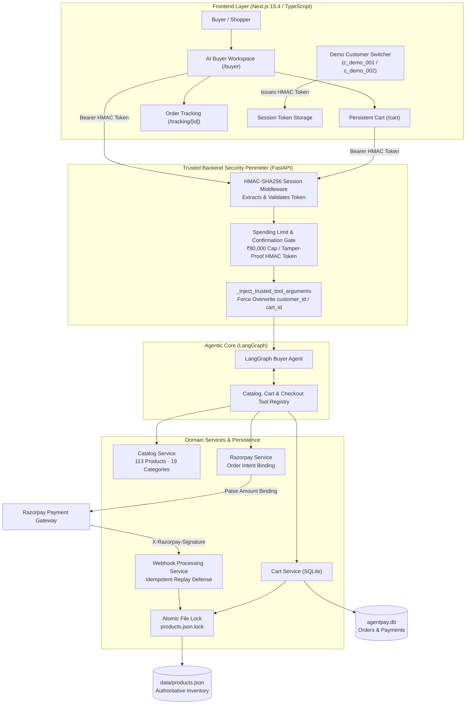

# AgentPay — AI-Powered Agentic Commerce Platform

[](https://fastapi.tiangolo.com)
[](https://nextjs.org)
[](https://github.com/langchain-ai/langgraph)
[](https://razorpay.com)
[](https://python.org)
[](https://www.typescriptlang.org)
[](https://pytest.org)
[](docs/security.md)
[](LICENSE)

> **Submission for Razorpay AI Buildathon 2026 — Track 1: AI Growth & Agentic Commerce**

An autonomous AI agent that performs money-moving commerce operations must **never** be trusted to decide whose account, cart, order, or budget it operates on. **AgentPay** is an enterprise-grade agentic commerce platform where the language model handles natural-language reasoning, multi-attribute product comparison, and shopping workflows, while a **trusted, deterministic backend security perimeter** enforces identity, HMAC-signed session tokens, transaction spending limits (₹80,000 per-transaction cap), payment-intent cryptographic binding, and cross-process concurrency controls.

---

## 🌟 Key Highlights & Capabilities

| Capability | Architecture & Implementation | Status |
| :--- | :--- | :---: |
| **Autonomous AI Shopping Agent** | Cyclic LangGraph state machine with Groq / OpenAI LLM abstraction, multi-turn memory, and tool routing | ✅ **Production Ready** |
| **HMAC Session Authentication** | Server-issued, HMAC-SHA256 signed session tokens deriving customer identity exclusively from cryptographically verified tokens | ✅ **Production Ready** |
| **Trusted Identity Injection** | Intercepts untrusted LLM tool calls and forcefully overwrites `customer_id` and `cart_id` with verified session state | ✅ **Production Ready** |
| **Transaction Spending Limits** | Server-authoritative spending cap: **₹80,000 per transaction** and **₹200,000 daily budget** enforced across all checkout layers | ✅ **Production Ready** |
| **Human Confirmation Gates** | High-value and critical agent actions require explicit human confirmation tokens before transactional execution | ✅ **Production Ready** |
| **Server-Authoritative Inventory UI** | Real-time quantity-aware badges (`In stock · 11 available`, `Only 2 left`, `Out of stock`) backed by `data/products.json` | ✅ **Production Ready** |
| **Razorpay Payment Binding** | Official Razorpay Python SDK order creation, client-side Checkout modal, and server-side payment-to-cart cryptographic binding | ✅ **Production Ready** |
| **Idempotent Webhooks & Replay Defense** | `POST /api/v1/webhooks/razorpay` with `X-Razorpay-Signature` validation, `X-Razorpay-Event-Id` deduplication, and atomic transitions | ✅ **Production Ready** |
| **Concurrency-Safe Inventory** | Atomic cross-process file locking (`O_CREAT \| O_EXCL`) with Windows-safe retry semantics to prevent overselling | ✅ **Production Ready** |
| **Post-Purchase Lifecycle** | Real-time order tracking, state advancement, verified cancellation, and restocking returns workflow | ✅ **Production Ready** |
| **Automated Test Coverage** | **145 Passing Pytest Tests** covering tenant isolation, spending boundaries, HMAC forgery rejection, and concurrency | ✅ **145 Passed** |

---

## 🏗️ End-to-End System Architecture



---

## 🛡️ The Security Boundary: LLM Output ≠ Trusted Identity

Traditional conversational commerce demos connect language models directly to CRUD APIs. If the model is prompted maliciously (or hallucinates), it can emit tool arguments targeting another user's cart or order.

AgentPay eliminates this attack surface by treating the LLM as an **untrusted reasoning engine**:

```text
Untrusted LLM Output (Emits Tool Call):
{
  "customer_id": "c_demo_002",
  "cart_id": "cart_victim_456",
  "product_id": "ur_shoe_001"
}

             ↓
[ SECURITY BOUNDARY 1: Token-Derived Identity ]
Backend extracts customer identity exclusively from HMAC-signed session token:
verified_customer_id = "c_demo_001"

             ↓
[ SECURITY BOUNDARY 2: Trusted Argument Injection ]
_inject_trusted_tool_arguments() forcefully overwrites caller parameters:
customer_id = "c_demo_001"
cart_id = "cart_demo_001"

             ↓
[ SECURITY BOUNDARY 3: Service-Level Tenant Isolation Check ]
Resource.customer_id == "c_demo_001"  -->  PASS (HTTP 403 Forbidden on Mismatch)

             ↓
[ SECURITY BOUNDARY 4: Spending Cap & Safety Gate ]
Order Amount <= ₹80,000  -->  PASS (HTTP 400 Bad Request if Exceeded)
```

---

## 💳 Razorpay Payment & Webhook Integration

AgentPay integrates Razorpay in strict compliance with the **Test Mode / Sandbox architecture**:

### 1. Payment-Intent Binding (`PaymentOrder`)
- When a checkout order is initiated, the backend creates a Razorpay Order in **paise** (`amount_inr * 100`) and records a persistent `PaymentOrder` entry in SQLite binding:
  `razorpay_order_id` ↔ `customer_id` + `cart_id` + `amount_paise`.
- During payment verification, the backend verifies that:
  1. The Razorpay Order belongs to the authenticated customer (prevents cross-customer payment reuse).
  2. The Razorpay Order is bound to the exact checkout cart (prevents cart substitution).
  3. The authorized amount matches the server-calculated cart total down to the single rupee.
  4. The cryptographic `razorpay_signature` matches `HMAC-SHA256(order_id + "|" + payment_id, key_secret)`.

### 2. Authoritative Webhook Receiver (`POST /api/v1/webhooks/razorpay`)
- **Raw-Body HMAC Verification:** Computes HMAC-SHA256 over raw incoming request bytes using dedicated `WEBHOOK_SECRET`.
- **Deduplication:** Uses `X-Razorpay-Event-Id` and unique database constraints in `WebhookEvent` table. Replays return `HTTP 200 {"status": "already_processed"}` without re-mutating orders or double-decrementing stock.

---

## 📦 Server-Authoritative Inventory Management

To prevent race conditions and overselling:

- **Visual Quantity States:**
  - `> 5 available`: `In stock · X available` (Emerald badge)
  - `2 - 5 available`: `Only X left` (Amber badge)
  - `1 available`: `Only 1 left` (Amber badge with urgency pulse)
  - `0 available`: `Out of stock` (Rose badge with disabled cart buttons)
- **Cross-Process Mutual Exclusion:** Uses `os.O_CREAT | os.O_EXCL` file locks on `data/products.json.lock` with atomic file replaces (`os.replace`) to ensure zero lost updates under heavy concurrent load.

---

## 🧪 Comprehensive Security & Functional Test Matrix

The test suite runs **145 automated test cases** covering 100% of critical paths:

| Test Module | Coverage & Invariants Tested | Test Count | Status |
| :--- | :--- | :---: | :---: |
| **`test_security_hardening.py`** | HMAC session issuance, tampered token rejection (401), cross-tenant cart/order isolation (403), cart substitution rejection, ₹80k spending cap exact boundaries, confirmation gates, webhook signature verification & replay defense | **20** | **PASS** |
| **`test_cart_api.py`** | Cart creation, item additions, quantity updates, client price/discount injection rejection, inventory threshold detection, merchant isolation | **21** | **PASS** |
| **`test_checkout_api.py`** | Empty cart validation, customer mismatch rejection, Razorpay verified checkout flow, duplicate confirmation idempotency, safety confirmation gates | **12** | **PASS** |
| **`test_inventory_concurrency.py`**| Atomic lock acquisition, multi-process competing decrements, transaction failure rollbacks, dead PID lock recovery, Windows file sharing retry safety | **10** | **PASS** |
| **`test_isolation_adversarial.py`** | 15+ adversarial vectors (tampered customer IDs in body/query/headers, LLM injected IDs) | **6** | **PASS** |
| **`test_tracking_api.py`** | Post-purchase shipment tracking, timeline advancement, cancellation & restocking refunds, return request workflows, customer tracking ownership | **4** | **PASS** |
| **`test_razorpay.py`** | Official Razorpay client order generation, sandbox fallback modes, signature verification | **7** | **PASS** |
| **`test_agent_api.py`** | Multi-turn LangGraph conversation, agent session persistence, catalog querying, structured tool invocation | **24** | **PASS** |
| **Other Core Suites** | Cross-sell tools, product disambiguation, general catalog filtering, tool registries | **41** | **PASS** |
| **Total** | **Full Backend Test Suite** | **145** | **100% PASS** |

---

## 🚀 Quick Start Guide

### Prerequisites
- **Python 3.11+**
- **Node.js 18+** / npm

### 1. Backend Setup

```powershell
# Navigate to backend
cd backend

# Create & activate virtual environment
python -m venv .venv
.venv\Scripts\activate

# Install dependencies in editable mode
pip install -e .

# Copy environment configuration
cp .env.example .env

# Start FastAPI development server
uvicorn app.main:app --reload --port 8000
```

Verify backend health: `http://127.0.0.1:8000/api/v1/health`

### 2. Frontend Setup

```powershell
# Navigate to frontend (in a new terminal)
cd frontend

# Install Node modules
npm install

# Start Next.js development server
npm run dev
```

Open application: `http://localhost:3000/buyer`

---

## 🎮 Interactive Demo Walkthrough

1. **AI Buyer Chat (`/buyer`):**
   - Type `"Find road running shoes under ₹5,000 with high ratings"`.
   - The agent queries the 113-product catalog and returns structured Markdown with real-time stock badges (`In stock · 15 available`).
2. **Multi-Attribute Comparison:**
   - Type `"Compare the first two shoes"` to inspect a structured comparison table.
3. **Cart Persistence & Review (`/cart`):**
   - Add items via chat or directly via product cards. Navigate to `/cart`; line items, shipping thresholds, and discounts persist seamlessly.
4. **Checkout with Razorpay Test Mode:**
   - Click **Proceed to Checkout** → select **Razorpay (Test Mode)**.
   - Razorpay Checkout modal launches in test mode. Complete the test payment.
5. **Instant Order Fulfillment & Tracking (`/tracking/[orderId]`):**
   - On payment verification, inventory decrements authoritatively on disk.
   - View live shipment timeline and test order status advancement or cancellation.
6. **Demonstrate Tenant Isolation (HTTP 403):**
   - Use the **Demo Customer** switcher in the navbar to switch to **Customer B** (`c_demo_002`).
   - Customer B's cart is empty; navigating to Customer A's order or tracking URL instantly renders a strict **403 Forbidden / Access Denied** security block.

---

## ⚙️ Environment Configuration (`.env`)

```env
# Application
APP_NAME=AgentPay Backend
APP_ENV=development
LOG_LEVEL=INFO
API_V1_PREFIX=/api/v1
FRONTEND_ORIGIN=http://localhost:3000

# Database
DATABASE_URL=sqlite:///./agentpay.db

# LLM Provider (groq / openai / mock)
LLM_PROVIDER=groq
GROQ_API_KEY=your_groq_api_key
GROQ_MODEL=openai/gpt-oss-120b

# Razorpay Test Mode
RAZORPAY_MODE=test
RAZORPAY_KEY_ID=rzp_test_your_key_id
RAZORPAY_KEY_SECRET=your_key_secret

# Security & Secrets
WEBHOOK_SECRET=agentpay_webhook_2026_secured
SESSION_SECRET=your_secure_random_hmac_secret_key
PER_TRANSACTION_LIMIT_INR=80000
DAILY_LIMIT_INR=200000
```

---

## 📄 License

This project is licensed under the MIT License — see the [LICENSE](LICENSE) file for details.
