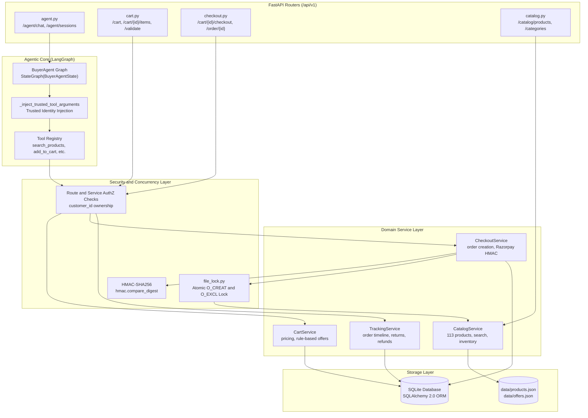

# AgentPay — Backend Engineering Guide

FastAPI + LangGraph backend service for AgentPay, an AI-native autonomous commerce platform built for the **Razorpay AI Buildathon 2026 (Track 1)**.

---

## 1. Backend Architecture



---

## 2. Agent / LangGraph Flow

- **File Path:** `app/agents/graph.py`
- **State Schema:** `BuyerAgentState` (`app/agents/state.py`)
- **Execution Loop:**
  1. `prepare_context`: Compacts historical tool outputs and prepares chat memory.
  2. `call_model`: Invokes configured LLM (Groq Llama 3.3 70B / GPT-OSS 120B, or `MockBuyerModel` fallback in `app/agents/model.py`).
  3. `has_tool_calls`: Conditional edge checking if model returned tool calls.
  4. `execute_tools`: Invokes `_inject_trusted_tool_arguments()`, resolves contextual references, runs deterministic tool functions, compacts results, and loops back.
  5. `format_response`: Assembles final assistant text and persists session state.

---

## 3. Tool Architecture

- **File Paths:** `app/agents/tools.py`, `app/tools/catalog_tools.py`, `app/tools/cart_tools.py`, `app/tools/checkout_tools.py`, `app/tools/tracking_tools.py`
- **Tool Registry:** Standard JSON Schema tool definitions exposed to the LLM:
  - `search_products(query, category, min_price, max_price, min_rating, sort_by)`
  - `get_product(product_id)`
  - `compare_products(product_ids)`
  - `get_related_products(product_id)` (reactive cross-sell and complementary accessories discovery)
  - `create_cart(customer_id, merchant_id)`
  - `add_to_cart(cart_id, customer_id, product_id, quantity)`
  - `get_cart(cart_id, customer_id)`
  - `update_cart_item(cart_id, customer_id, product_id, quantity)`
  - `remove_from_cart(cart_id, customer_id, product_id)`
  - `validate_cart(cart_id, customer_id)`
  - `checkout_cart(cart_id, customer_id, payment_method)`
  - `get_order(order_id, customer_id)`
  - `get_order_tracking(order_id, customer_id)`

---

## 4. Trusted Argument Injection

- **File Path:** `app/agents/graph.py` (`_inject_trusted_tool_arguments`)
- **Mechanism:**
  ```python
  def _inject_trusted_tool_arguments(
      state: BuyerAgentState,
      tool_name: str,
      arguments: dict[str, Any],
  ) -> dict[str, Any]:
      safe_arguments = dict(arguments)
      # Forcefully inject verified customer identity
      if tool_name in {
          "add_to_cart", "get_cart", "update_cart_item", "remove_from_cart",
          "validate_cart", "checkout_cart", "get_order", "get_order_tracking",
          "cancel_order", "request_return"
      }:
          safe_arguments["customer_id"] = state.customer_id
      # Forcefully inject verified cart context
      if tool_name in {"add_to_cart", "get_cart", "update_cart_item", "remove_from_cart", "validate_cart", "checkout_cart"}:
          if state.cart_id:
              safe_arguments["cart_id"] = state.cart_id
      return safe_arguments
  ```

---

## 5. Domain Services

- **Catalog Service (`app/services/catalog_service.py`):** Loads 113 products across 19 categories from `data/products.json`, supports multi-attribute filtering, price range parsing, full-text matching, and in-memory caching.
- **Cart Service (`app/services/cart_service.py`):** Handles cart lifecycle, line-item pricing snapshots, rule-based offer evaluation (`data/offers.json`), and discount calculation.
- **Checkout Service (`app/services/checkout_service.py`):** Performs pre-checkout cart validation, Razorpay order generation, HMAC-SHA256 signature verification, inventory locking, and order persistence.
- **Tracking Service (`app/services/tracking_service.py`):** Tracks order timelines, demo status advancement, cancellations, and return policies.

---

## 6. Razorpay Service & Signature Verification

- **Integration:** Official `razorpay.Client` SDK.
- **Verification:**
  ```python
  def verify_payment_signature(razorpay_order_id, razorpay_payment_id, razorpay_signature, key_secret):
      msg = f"{razorpay_order_id}|{razorpay_payment_id}".encode("utf-8")
      expected = hmac.new(key_secret.encode("utf-8"), msg, hashlib.sha256).hexdigest()
      return hmac.compare_digest(expected, razorpay_signature)
  ```
- **Fallback:** Sandboxed `mock_upi` and `mock_card` payment methods enable offline local testing without requiring external credentials.

---

## 7. Inventory Locking & Concurrency

- **File Path:** `app/services/file_lock.py`
- **Mechanism:** Cross-process atomic file creation via `os.O_CREAT | os.O_EXCL | os.O_WRONLY`.
- **Windows Safety:** Retries on transient `WinError 32` (`ERROR_SHARING_VIOLATION`) and checks PID liveness with `psutil.pid_exists(pid)`.
- **Stress Test:** Verified with `mp_lock_stress.py` (4 worker processes, `RESULT: PASS`).

---

## 8. Authorization Model

All API endpoints and domain services verify that the requesting `customer_id` matches the stored resource owner:
```python
if cart.customer_id != customer_id:
    raise HTTPException(status_code=403, detail="Access denied: Cart belongs to another customer")
```

---

## 9. Testing & Verification

```powershell
# Run full suite (124 passed, 2 skipped, 2 warnings)
.venv\Scripts\python -m pytest -q

# Run customer isolation tests
.venv\Scripts\python -m pytest tests/test_isolation.py tests/test_isolation_adversarial.py -v

# Run inventory concurrency stress test
.venv\Scripts\python mp_lock_stress.py
```

---

## 10. Running Locally

```powershell
cd backend
python -m venv .venv
.venv\Scripts\activate
pip install -e .
cp .env.example .env
uvicorn app.main:app --reload --port 8000
```
OpenAPI documentation: `http://127.0.0.1:8000/docs`
