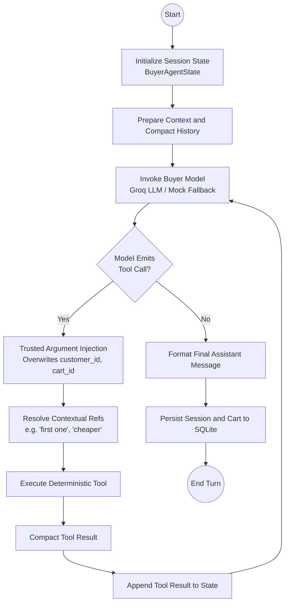

# AgentPay Agent Interaction & Decision Flow

This document details the LangGraph agent orchestration, state graph transitions, tool binding, and contextual reference resolution mechanisms in **AgentPay**.

---

## 1. Agent Graph State Machine

The buyer agent is built on **LangGraph** using a cyclic graph that alternates between model reasoning and deterministic tool execution:



---

## 2. Agent State Definition (`BuyerAgentState`)

```python
class BuyerAgentState(BaseModel):
    session_id: str
    customer_id: str
    cart_id: str | None = None
    user_message: str
    messages: list[dict[str, Any]] = Field(default_factory=list)
    tool_history: list[dict[str, Any]] = Field(default_factory=list)
    pending_tool_calls: list[ToolCall] = Field(default_factory=list)
    final_response: str | None = None
    step_count: int = 0
```

---

## 3. Supported Agent Tools

| Tool | Purpose | Handled By |
| :--- | :--- | :--- |
| `search_products` | Search catalog with filters, price constraints, and sorting | `catalog_service.search_products` |
| `get_product` | Retrieve full product details by product ID | `catalog_service.get_product_by_id` |
| `compare_products` | Side-by-side comparison of 2 or more products | `catalog_service.get_products_by_ids` |
| `get_related_products` | Discover matching accessories, apparel, or related items (reactive cross-sell) | `catalog_service.get_related_products` |
| `create_cart` | Initialize a new shopping cart for the customer | `cart_service.create_cart` |
| `add_to_cart` | Add a product SKU and quantity to the customer's cart | `cart_service.add_item_to_cart` |
| `get_cart` | View items, applied discounts, and totals in active cart | `cart_service.get_cart_by_id` |
| `update_cart_item` | Modify item quantity in the customer's active cart | `cart_service.update_item_quantity` |
| `remove_from_cart` | Remove an item from the customer's active cart | `cart_service.remove_item_from_cart` |
| `validate_cart` | Run stock, pricing, and policy validation on the cart | `cart_service.validate_cart` |
| `checkout_cart` | Initiate order checkout from cart | `checkout_service.checkout_cart` |
| `get_order` | Retrieve placed order details | `checkout_service.get_order_by_id` |
| `get_order_tracking` | Retrieve live shipment tracking timeline | `tracking_service.get_tracking_info` |

---

## 4. Multi-Turn Contextual Reference Resolution

When a user says:
- *"Add the second one to my cart"*
- *"Compare the first two shoes"*
- *"Which one is cheaper?"*
- *"Add it to cart"*

The agent graph's `_resolve_product_arguments` function resolves these references against the **actual historical catalog tool results** stored in application memory, rather than allowing the LLM to guess or fabricate a synthetic product ID. This guarantees deterministic behavior and prevents hallucinations from creating invalid cart items.

---

## 5. Markdown Presentation in Buyer UI

When the agent responds with product comparisons, feature tables, bullet lists, or bolded product recommendations:
- The frontend pre-processes and normalizes markdown boundaries.
- Responses are rendered via `react-markdown` + `remark-gfm`.
- Tables are enclosed in responsive containers with light styled headers and padded cells.
- Raw HTML is disabled by default to prevent script injection.
