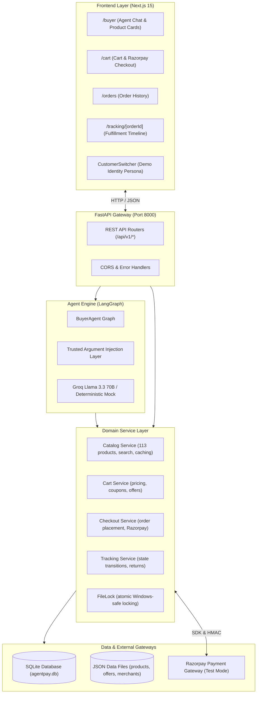

# AgentPay System Architecture

Technical architectural specification for **AgentPay**, an AI-native commerce agent platform developed for the **Razorpay AI Buildathon 2026 (Track 1)**.

---

## 1. System Context & Overview

AgentPay connects conversational natural-language discovery directly to a transactional commerce engine. Unlike classical e-commerce platforms that rely on static browsing catalogs, AgentPay exposes an AI agent that acts on behalf of the customer to search, filter, compare, configure, checkout, and track orders across an extensible product catalog.

---

## 2. Key Subsystems

### A. AI Agent Orchestration (LangGraph)
- **State Machine:** Maintained as a LangGraph `StateGraph(BuyerAgentState)`.
- **Context Compaction:** Historical search results and tool responses are compacted to maintain high token efficiency and prevent context explosion.
- **Reference Resolution:** Disambiguates contextual linguistic references (e.g. *"the first one"*, *"the cheaper one"*, *"it"*) against verified historical catalog outputs.
- **Trusted Argument Injection:** Intercepts LLM tool invocations to overwrite `customer_id`, `cart_id`, and `merchant_id` with verified session values.

### B. Catalog & Offers Engine
- **Catalog Dataset:** 113 products categorized into running shoes, trail running, apparel, sports watches, hydration, headphones, yoga, cycling, fitness equipment, and accessories.
- **Rule-Based Offers:** Evaluates volume discounts, category promos, and bundle offers deterministically.
- **Inventory Locking:** Protects inventory state from overselling during concurrent checkouts using `file_lock.py`.

### C. Checkout & Payment Integration
- **Razorpay SDK:** Generates server-side payment orders and validates client responses.
- **Cryptographic Verification:** Server recalculates HMAC-SHA256 of `razorpay_order_id|razorpay_payment_id` and verifies with `hmac.compare_digest`.
- **Idempotent Order Creation:** Ensures duplicate callbacks or replayed requests do not create duplicate orders or deduct inventory twice.

### D. Order Lifecycle & Fulfillment Tracking
- **Timeline Engine:** Tracks fulfillment states (`placed` → `confirmed` → `packed` → `shipped` → `out_for_delivery` → `delivered`).
- **Cancellations & Refunds:** Allows cancellation of unfulfilled orders with immediate payment refund simulation.
- **Returns Management:** Validates return window policies (e.g., 30-day return policy) and records structured return requests.
