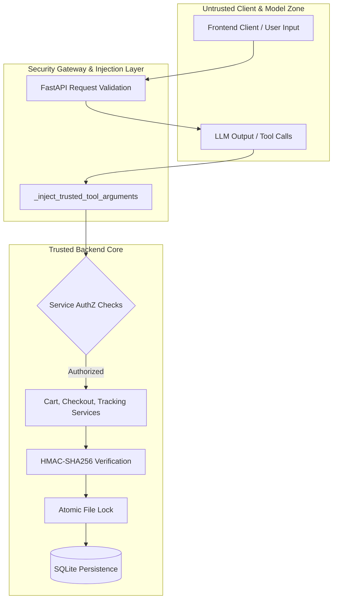

# AgentPay Security Model & Threat Specification

This document details the security architecture, threat model, cryptographic verifications, and customer isolation guarantees implemented in **AgentPay**.

---

## 1. Security Goals

1. **Protect Tenant Boundaries:** Prevent any customer persona from viewing, modifying, checking out, or tracking another customer's resources.
2. **Prevent LLM Identity Spoofing:** Ensure that LLM reasoning or prompt injection attacks cannot manipulate ownership-sensitive parameters.
3. **Guarantee Cryptographic Payment Integrity:** Ensure that orders are only finalized when verified by server-calculated HMAC-SHA256 digests.
4. **Serialize Inventory Updates:** Eliminate race conditions during concurrent checkouts for constrained inventory items.

---

## 2. Threat Model

| Threat Vector | Potential Impact | Mitigation Strategy |
| :--- | :--- | :--- |
| **LLM Tool Argument Forgery** | Attacker prompts LLM to modify another customer's cart or inspect their orders. | **Trusted Tool Argument Injection**: Server overwrites all ownership-sensitive fields (`customer_id`, `cart_id`, `merchant_id`) before tool execution. |
| **Cross-Tenant Direct API Tampering** | Attacker queries REST endpoints directly with mismatched IDs (e.g. `GET /cart/{b}?customer_id={a}`). | **Service-Level Authorization**: Route handlers and domain services query database ownership and enforce strict `HTTP 403 Forbidden` checks. |
| **Payment Signature Forgery** | Malicious client submits fake Razorpay order confirmation or tampered amount. | **Server-Side HMAC-SHA256**: All payments are verified using `hmac.compare_digest` against the server-stored `RAZORPAY_KEY_SECRET`. |
| **Duplicate Payment Callbacks / Idempotency** | Replay of valid payment callbacks to place multiple orders or trigger multiple inventory drops. | **Idempotent Order Creation**: Payment IDs and transaction references are recorded and checked before order insertion. |
| **Inventory Overselling Race Condition** | Concurrent checkouts for the last in-stock item cause negative inventory. | **Windows-Safe File Locking**: Atomic `O_CREAT | O_EXCL` file lock ensures serialized inventory decrements across OS processes. |
| **Credential Exposure** | API keys or webhook secrets leaked to frontend client or version control. | **Strict Backend Secret Storage**: Razorpay key secret and Groq API keys remain strictly server-side in environment variables. |

---

## 3. Trust Boundaries



---

## 4. Customer Isolation

AgentPay implements strict customer tenant isolation:
- **Cart Isolation:** Cart records in SQLite are bound to a specific `customer_id`.
- **Order Isolation:** Order records are linked to the owning `customer_id`.
- **Tracking Isolation:** Tracking timelines are only accessible to the owning `customer_id`.
- **Cross-Tenant Prevention:** Any request with a mismatched `customer_id` is immediately rejected with `HTTP 403 Forbidden`.

---

## 5. Trusted Argument Injection

### The Principle: LLM Output ≠ Trusted Identity

In `backend/app/agents/graph.py`, `_inject_trusted_tool_arguments()` intercepts every tool call emitted by the model before invocation:

```python
def _inject_trusted_tool_arguments(
    state: BuyerAgentState,
    tool_name: str,
    arguments: dict[str, Any],
) -> dict[str, Any]:
    safe_arguments = dict(arguments)

    # Injected from verified application session state
    if tool_name in {
        "add_to_cart", "get_cart", "update_cart_item", "remove_from_cart",
        "validate_cart", "checkout_cart", "get_order", "get_order_tracking",
        "cancel_order", "request_return"
    }:
        safe_arguments["customer_id"] = state.customer_id

    if tool_name in {"add_to_cart", "get_cart", "update_cart_item", "remove_from_cart", "validate_cart", "checkout_cart"}:
        if state.cart_id:
            safe_arguments["cart_id"] = state.cart_id

    return safe_arguments
```

Regardless of what `customer_id` or `cart_id` the model generates in its tool call, the server intercepts and overwrites those arguments with the session's verified context.

---

## 6. Agent Tool Authorization

Tools executed by the LangGraph agent do not trust caller input:
- Each tool receives the sanitized, server-injected arguments.
- If a tool is called directly in Python tests with an unauthorized customer ID, it raises a `PermissionError` or `ValueError`.

---

## 7. API Authorization

All REST API endpoints (`/api/v1/cart/*`, `/api/v1/checkout/*`) enforce database ownership checks:
```python
if cart.customer_id != customer_id:
    raise HTTPException(status_code=403, detail="Access denied: Cart belongs to another customer")
```
Missing `customer_id` query parameters are rejected by FastAPI with `HTTP 422 Unprocessable Entity`.

---

## 8. Razorpay Payment Verification

When a payment completes in the client-side Razorpay modal:
1. The client sends `razorpay_order_id`, `razorpay_payment_id`, and `razorpay_signature` to `/api/v1/cart/{id}/checkout`.
2. The server recalculates the cryptographic signature using the server-side `RAZORPAY_KEY_SECRET`.
3. The order is only committed if the signature matches exactly.

---

## 9. HMAC-SHA256

In `backend/app/services/checkout_service.py`:
```python
def verify_payment_signature(
    razorpay_order_id: str,
    razorpay_payment_id: str,
    razorpay_signature: str,
    key_secret: str,
) -> bool:
    message = f"{razorpay_order_id}|{razorpay_payment_id}".encode("utf-8")
    expected = hmac.new(
        key_secret.encode("utf-8"),
        message,
        hashlib.sha256,
    ).hexdigest()
    return hmac.compare_digest(expected, razorpay_signature)
```
Using `hmac.compare_digest` ensures constant-time execution, preventing timing side-channel attacks.

---

## 10. Inventory Concurrency & Locking

To prevent overselling:
- `backend/app/services/file_lock.py` uses atomic `os.O_CREAT | os.O_EXCL` flags.
- Stale process deadlocks are prevented by inspecting process liveness with `psutil.pid_exists(pid)`.
- Windows `WinError 32` (`ERROR_SHARING_VIOLATION`) is handled with exponential backoff retries.

---

## 11. Adversarial Test Matrix

| # | Attack Scenario | Endpoint / Function | Expected Response | Status |
| :---: | :--- | :--- | :---: | :---: |
| 1 | Customer A fetches Customer B's cart | `GET /api/v1/cart/{b_id}?customer_id=a` | `403 Forbidden` | **PASS** |
| 2 | Customer A adds item to Customer B's cart | `POST /api/v1/cart/{b_id}/items?customer_id=a` | `403 Forbidden` | **PASS** |
| 3 | Customer A modifies item in B's cart | `PATCH /api/v1/cart/{b_id}/items/{pid}?customer_id=a` | `403 Forbidden` | **PASS** |
| 4 | Customer A removes item from B's cart | `DELETE /api/v1/cart/{b_id}/items/{pid}?customer_id=a` | `403 Forbidden` | **PASS** |
| 5 | Customer A deletes B's cart | `DELETE /api/v1/cart/{b_id}?customer_id=a` | `403 Forbidden` | **PASS** |
| 6 | Customer A validates Customer B's cart | `POST /api/v1/cart/{b_id}/validate?customer_id=a` | `403 Forbidden` | **PASS** |
| 7 | Customer A checks out Customer B's cart | `POST /api/v1/cart/{b_id}/checkout` | `400 / 403 Forbidden` | **PASS** |
| 8 | Customer A reads Customer B's order | `GET /api/v1/checkout/order/{b_id}?customer_id=a` | `403 Forbidden` | **PASS** |
| 9 | Customer A tracks Customer B's shipment | `GET /api/v1/checkout/order/{b_id}/tracking?customer_id=a` | `403 Forbidden` | **PASS** |
| 10 | Customer A cancels Customer B's order | `POST /api/v1/checkout/order/{b_id}/cancel` | `403 Forbidden` | **PASS** |
| 11 | Customer A requests return on B's order | `POST /api/v1/checkout/order/{b_id}/return` | `403 Forbidden` | **PASS** |
| 12 | Tool execution with forged customer ID | `get_cart(..., customer_id="a")` on B | `PermissionError / ValueError` | **PASS** |
| 13 | Agent LLM emits forged `customer_id="b"` | LangGraph `_inject_trusted_tool_arguments` | Injected as `"a"` | **PASS** |
| 14 | Missing customer ID in API route | `GET /api/v1/checkout/order/{id}` (no param) | `422 Unprocessable Entity` | **PASS** |

---

## 12. Authentication vs. Authorization

> [!IMPORTANT]
> **Authentication vs Authorization Scope:**
> 
> **AgentPay does not implement production authentication.** Demo customer IDs are selectable identities rather than cryptographically authenticated identities.
> 
> **Authorization is enforced independently at the REST API and agent tool layers** so that an agent operating under one trusted customer identity cannot use tool arguments to cross into another customer's resources.

---

## 13. Known Limitations

1. **Demo Personas:** Uses selectable customer IDs (`c_demo_001`, `c_demo_002`) instead of OAuth/JWT identity providers.
2. **Local Storage:** Utilizes SQLite and local filesystem storage.
3. **Single-Node Locking:** File-based lock mechanism operates locally rather than using a distributed lock manager (e.g., Redis Redlock).
4. **Razorpay Test Mode:** Built for test mode credentials and sandboxed webhook events.

---

## 14. Security Checklist

- [x] Secrets stored exclusively in server `.env`
- [x] LLM tool arguments intercepted and overwritten server-side
- [x] REST API routes reject unauthorized customer access with HTTP 403
- [x] Razorpay signatures verified with constant-time `hmac.compare_digest`
- [x] Concurrent checkouts protected with atomic file lock
- [x] Adversarial test suite passing with 100% success rate
